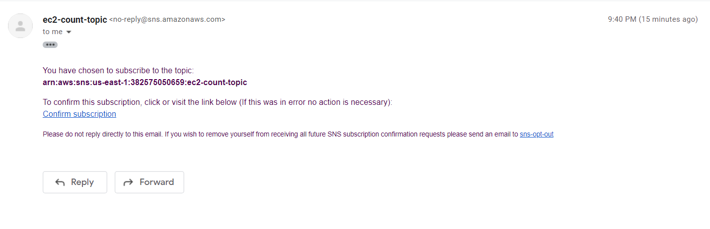
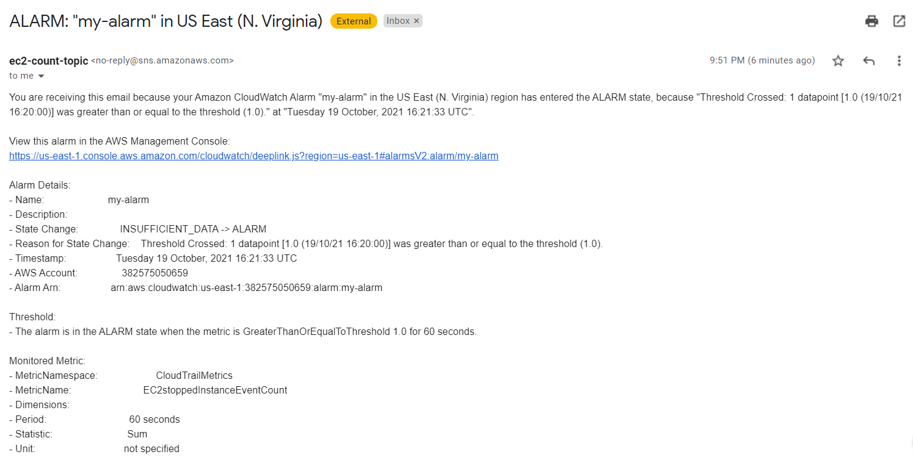
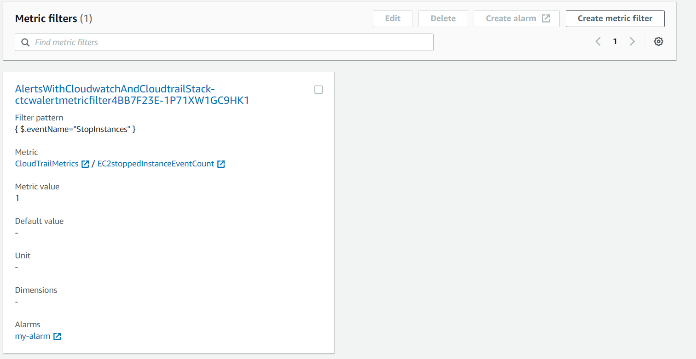
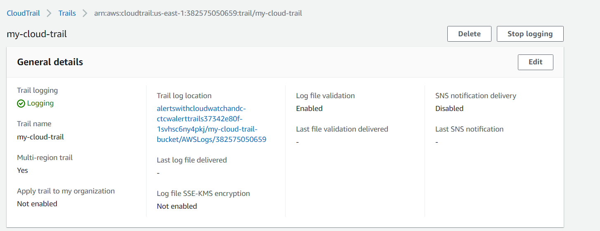
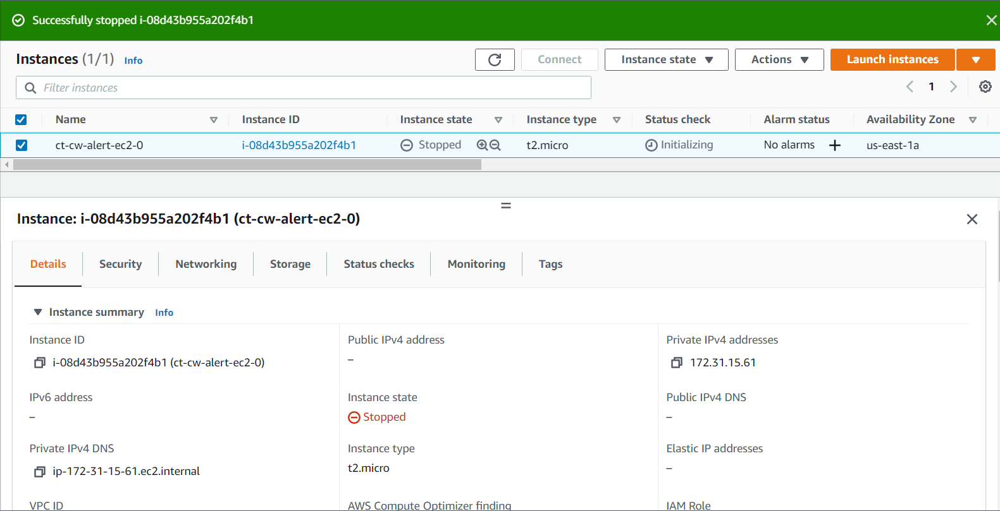

# This lab walks you through the steps to create a Cloudtrail and CloudWatch log group , while also creating a metric filter to receive an alarm from CloudWatch via SNS topic with AWS CDK

This is a AWS CDK project that creates
*	Creating a SNS topic to receive alarm email
*   Creating a CloudTrail 
* 	Creating Metric Filters for Log Groups in Cloudwatch
*	Creating an Alarm.
*	Creating an EC2 instance and stopping it to trigger an alarm that sends email to registered email id.

## Useful commands

 * `cdk deploy`   deploys stack.
 * `cdk synth`    compiles ts project to generate cloudformation
 
 
# Images

