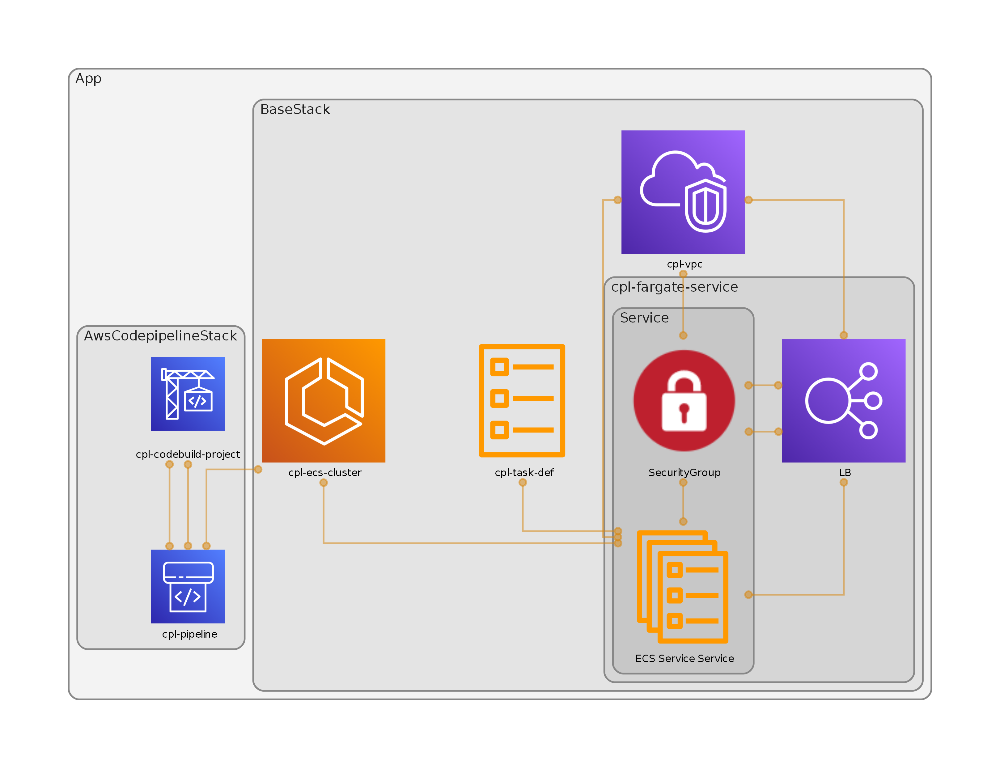

## AWS Codepipeline
This project constructs a codepipeline that fetches code from github, builds the project and
deploys the code to aws fargarte as ECS container service.

<!-- ##Use local tools
###Initialize project: `npx aws-cdk init --language typescript`

###Build:	`npm run build`

###Run CDK: `npx aws-cdk ...` -->

## Commands to deploy the stack
### Deploying pipeline
### `1. npm run create-ecr`
This command will perform 2 things. 

First, check if ECR repository exists, if it exists it checks if there is a image in repository.
If there is a image present, everything is correct. If not, the script will push a local project docker image to the repository.

Second, if there is no repository. The script will create a new ECR repository and push a local project docker image to the repository.

The reason for this is to make sure the Fargate Service creation through cdk does not fail as fargate service requires, image to be present.

The creation of ECR through cdk is not advisable as if for some reason we want to destroy a stack, the destroy command will fail if there is a image present in the ECR.
In this case, we have to manually delete the stack from the console.

### `2. npx cdk synth --context githubToken=<github-oauth-token>`

### `3. npx cdk deploy BaseStack --context githubToken=<github-oauth-token>`

### `4. npx cdk deploy AwsCodepipelineStack --context githubToken=<github-oauth-token>`

### Deleting pipeline
### `npx cdk destroy * --context githubToken=<github-oauth-token>`

### Architecture diagram

