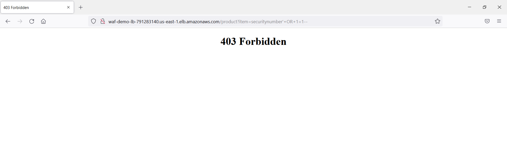

# Blocking malicious web traffic using WAF with AWS CDK

This is a AWS CDK project that creates
*   Application load balancer, EC2 instance.
*	Create sql injection rule and query parameter rule for `?admin` path
*	If the url contains a sql injection code like `/product?item=securitynumber'+OR+1=1--` then WAF will throw `403 Forbidden` error.
*	If the url contains a query string like `/?admin` then WAF will throw `403 Forbidden` error.

## Useful commands

 * `cdk deploy`   deploys Attribute based access control stack.
 * `cdk synth`    compiles ts project to generate cloudformation
 
 
# Images
 
## Working instance

## SQL Injection error

## Unauthorized query parameter `?admin` error

